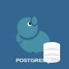

# EPS364 Docker Development Environment

Este repositório contém configurações Docker Compose para ferramentas de desenvolvimento. **NÃO UTILIZAR EM PRODUÇÃO**.

## 🚀 Configuração Inicial

Primeiro, copie o arquivo de exemplo das variáveis de ambiente para criar o seu próprio:

```bash
cp .env.example .env
```

Personalize as variáveis dentro do arquivo `.env` conforme necessário.

## 📁 Estrutura do Projeto

Este repositório está organizado com serviços independentes, cada um em sua própria pasta:

| Ícone | Pasta | Serviço | Descrição | Porta |
|-------|-------|---------|-----------|-------|
|  | `postgres/` | PostgreSQL 17 | Banco de dados relacional | 5432 |
|  | `sonar/` | SonarQube Community | Análise de qualidade de código | 9000 |
|  | `mailhog/` | MailHog | Interceptador de emails para testes | 8025 (Web UI), 1025 (SMTP) |
|  | `portainer/` | Portainer | Interface de gerenciamento Docker | 9443 |
|  | `keycloak/` | Keycloak | Gerenciamento de identidade e acesso | 8080 |
| !LocalStack | `localStack/` | LocalStack | Simulador de nuvem AWS local | 4566 |

## 🏃‍♂️ Como Usar

Cada pasta contém seu próprio `README.md` com instruções específicas do serviço. Para executar qualquer serviço:

```bash
# Padrão geral
docker compose -f '<pasta>/docker-compose.yml' up -d
```

### Links Rápidos
- **PostgreSQL**: [postgres/README.md](postgres/README.md)
- **SonarQube**: [sonar/README.md](sonar/README.md) - http://localhost:9000
- **MailHog**: [mailhog/README.md](mailhog/README.md) - http://localhost:8025
- **Portainer**: [portainer/README.md](portainer/README.md) - https://localhost:9443
- **Keycloak**: [keycloak/README.md](keycloak/README.md) - http://localhost:8080
- **LocalStack**: localStack/README.md - Endpoint: http://localhost:4566

## 🛠️ Comandos Úteis

```bash
# Ver todos os contêineres em execução
docker ps

# Ver logs de um contêiner específico
docker logs <container-name>

# Parar todos os serviços
docker compose down

# Limpar volumes não utilizados
docker volume prune
```

## 🎨 Ícones dos Serviços

Cada serviço possui um ícone SVG personalizado localizado na pasta `images/`:

- **Keycloak**: Chave com escudo de segurança
- **MailHog**: Envelope com porco estilizado  
- **Portainer**: Stack de containers com guindaste
- **PostgreSQL**: Elefante com banco de dados
- **LocalStack**: Cubo 3D representando uma "nuvem local"
- **SonarQube**: Ondas sonoras com análise de código

Para mais detalhes sobre os ícones, consulte: [images/README.md](images/README.md)

## ⚙️ Configurações Avançadas

### Variáveis de Ambiente

O arquivo `.env` contém todas as configurações dos serviços:

```bash
# Copiar arquivo de exemplo
cp .env.example .env

# Editar configurações
nano .env  # ou seu editor preferido
```

### Portas Personalizadas

Para evitar conflitos, você pode alterar as portas no arquivo `.env`:

```bash
# Exemplo: alterar porta do Keycloak
KEYCLOAK_PORT=8181
```

### Redes Docker

Cada serviço possui sua própria rede isolada:
- `postgres-network` - PostgreSQL
- `keycloak-network` - Keycloak + PostgreSQL dedicado  
- `sonar-network` - SonarQube + PostgreSQL dedicado
- `mailhog-network` - MailHog
- `portainer-network` - Portainer

## 🔒 Segurança

### ⚠️ IMPORTANTE - Desenvolvimento Apenas

Este ambiente é configurado para **DESENVOLVIMENTO LOCAL APENAS**:

- Senhas padrão simples
- Configurações de segurança relaxadas  
- Dados não criptografados
- Certificados auto-assinados

### Recomendações para Produção

Se adaptar para produção, considere:

1. **Senhas seguras** - Use senhas complexas
2. **Certificados válidos** - Configure SSL/TLS adequado
3. **Rede isolada** - Use redes privadas
4. **Backup regular** - Configure backup automático
5. **Monitoramento** - Implemente logging e alertas
6. **Atualizações** - Mantenha versões atualizadas

## � Troubleshooting

### Problemas Comuns

**Porta já em uso:**
```bash
# Verificar quais portas estão sendo usadas
netstat -tulpn | grep :8080
# ou
lsof -i :8080
```

**Container não inicia:**
```bash
# Verificar logs
docker compose -f <pasta>/docker-compose.yml logs
# Verificar status
docker compose -f <pasta>/docker-compose.yml ps
```

**Problemas de permissão:**
```bash
# Limpar volumes (CUIDADO: apaga dados)
docker compose -f <pasta>/docker-compose.yml down -v
# Recriar containers
docker compose -f <pasta>/docker-compose.yml up -d --force-recreate
```

### Limpeza do Sistema

```bash
# Parar todos os serviços
find . -name "docker-compose.yml" -exec dirname {} \; | xargs -I {} docker compose -f {}/docker-compose.yml down

# Limpar volumes não utilizados
docker volume prune -f

# Limpar containers parados
docker container prune -f
```

## �📋 Pré-requisitos

- **Docker** (versão 20.10 ou superior)
- **Docker Compose** (versão 2.0 ou superior) 
- **Git** (para clonagem do repositório)
- Arquivo `.env` configurado (copie de `.env.example`)
- **Recursos mínimos**: 4GB RAM, 10GB espaço em disco