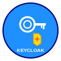

# Keycloak - Identity and Access Management



Keycloak é uma solução open-source de gerenciamento de identidade e acesso que fornece autenticação, autorização, gerenciamento de usuários e federação de identidades para aplicações modernas.

## 🚀 Como Usar

### Iniciar o Serviço

```bash
docker compose -f keycloak/docker-compose.yml up -d
```

### Parar o Serviço

```bash
docker compose -f keycloak/docker-compose.yml down
```

## 🌐 Acesso à Interface

- **Console Admin**: http://localhost:8080/admin
- **Portal de Usuário**: http://localhost:8080/realms/{realm-name}/account
- **Usuário Admin Padrão**: admin
- **Senha Admin Padrão**: admin

> **Importante**: Altere as credenciais padrão em produção!

## 🏗️ Arquitetura do Serviço

### Keycloak Container
- **Imagem**: `quay.io/keycloak/keycloak:26.0`
- **Porta**: 8080
- **Modo**: Development (start-dev)
- **Health Check**: Habilitado
- **Métricas**: Habilitadas

### PostgreSQL Container (Dedicado)
- **Imagem**: `postgres:15`
- **Porta**: 5433 (para evitar conflito com PostgreSQL principal)
- **Database**: keycloak
- **Usuário**: keycloak
- **Health Check**: Habilitado

## 💾 Volumes Persistentes

| Volume | Descrição | Path no Container |
|--------|-----------|-------------------|
| `keycloak_data` | Dados do Keycloak | `/opt/keycloak/data` |
| `keycloak_db_data` | Dados do PostgreSQL | `/var/lib/postgresql/data` |

## 🔧 Variáveis de Ambiente

Configure no arquivo `.env` na raiz do projeto:

```bash
# Credenciais do Admin Keycloak
KEYCLOAK_ADMIN=admin
KEYCLOAK_ADMIN_PASSWORD=admin123

# Configurações do Banco de Dados
KC_DB_USERNAME=keycloak
KC_DB_PASSWORD=keycloak123
```

## 📋 Configuração Inicial

### 1. Primeiro Acesso
1. Aguarde a inicialização completa (~2-3 minutos)
2. Acesse http://localhost:8080/admin
3. Faça login com as credenciais admin configuradas
4. **Altere a senha padrão** imediatamente

### 2. Criar um Realm
1. No menu lateral, clique em **"Create Realm"**
2. Defina um nome (ex: "meu-app")
3. Configure as opções básicas:
   - **Enabled**: True
   - **User registration**: True/False conforme necessário
   - **Email as username**: Conforme preferência

### 3. Configurar um Client
1. Vá para **Clients** → **Create client**
2. Configure:
   - **Client type**: OpenID Connect
   - **Client ID**: meu-app-client
   - **Name**: Nome amigável
3. Em **Capability config**:
   - **Client authentication**: ON (para aplicações server-side)
   - **Authorization**: ON (se precisar de autorização fina)
4. Em **Login settings**:
   - **Valid redirect URIs**: http://localhost:3000/*
   - **Web origins**: http://localhost:3000

## 🔐 Integração com Aplicações

### Spring Boot (Spring Security + OAuth2)

```yaml
# application.yml
spring:
  security:
    oauth2:
      client:
        registration:
          keycloak:
            client-id: meu-app-client
            client-secret: {client-secret}
            scope: openid,profile,email
            authorization-grant-type: authorization_code
            redirect-uri: http://localhost:8080/login/oauth2/code/keycloak
        provider:
          keycloak:
            issuer-uri: http://localhost:8080/realms/meu-app
            user-name-attribute: preferred_username
```

### Node.js (Passport.js)

```javascript
const passport = require('passport');
const KeycloakStrategy = require('passport-keycloak-oauth2');

passport.use('keycloak', new KeycloakStrategy({
  clientID: 'meu-app-client',
  clientSecret: 'client-secret',
  callbackURL: 'http://localhost:3000/auth/keycloak/callback',
  authorizationURL: 'http://localhost:8080/realms/meu-app/protocol/openid-connect/auth',
  tokenURL: 'http://localhost:8080/realms/meu-app/protocol/openid-connect/token',
  userInfoURL: 'http://localhost:8080/realms/meu-app/protocol/openid-connect/userinfo'
}));
```

### React (OIDC Client)

```javascript
import { UserManager } from 'oidc-client-ts';

const userManager = new UserManager({
  authority: 'http://localhost:8080/realms/meu-app',
  client_id: 'meu-app-client',
  redirect_uri: 'http://localhost:3000/callback',
  response_type: 'code',
  scope: 'openid profile email'
});
```

## 🎯 Recursos Principais

### Autenticação
- ✅ Login/Logout
- ✅ Multi-Factor Authentication (MFA)
- ✅ Social Login (Google, Facebook, GitHub, etc.)
- ✅ Single Sign-On (SSO)
- ✅ Identity Brokering

### Autorização
- ✅ Role-Based Access Control (RBAC)
- ✅ Attribute-Based Access Control (ABAC)
- ✅ Fine-Grained Authorization
- ✅ Policy-Based Authorization

### Gerenciamento de Usuários
- ✅ Registro de usuários
- ✅ Perfil de usuário
- ✅ Verificação de email
- ✅ Reset de senha
- ✅ Federação de usuários (LDAP/AD)

### Protocolos Suportados
- ✅ OpenID Connect
- ✅ OAuth 2.0
- ✅ SAML 2.0
- ✅ WS-Federation

## 🛠️ Comandos Úteis

```bash
# Ver logs do Keycloak
docker logs keycloak

# Ver logs do banco
docker logs keycloak-db

# Acessar container do Keycloak
docker exec -it keycloak bash

# Backup do banco de dados
docker exec keycloak-db pg_dump -U keycloak keycloak > keycloak_backup.sql

# Restaurar backup
docker exec -i keycloak-db psql -U keycloak keycloak < keycloak_backup.sql

# Verificar saúde dos serviços
curl http://localhost:8080/health/ready
curl http://localhost:8080/health/live

# Métricas do Keycloak
curl http://localhost:8080/metrics
```

## 🔧 Configurações Avançadas

### Temas Customizados
1. Crie uma pasta `themes` no volume do Keycloak
2. Desenvolva seu tema personalizado
3. Configure no Admin Console

### Providers Customizados
```bash
# Adicionar JARs customizados
docker cp meu-provider.jar keycloak:/opt/keycloak/providers/
docker restart keycloak
```

### Configuração via CLI
```bash
# Executar comandos admin-cli
docker exec -it keycloak /opt/keycloak/bin/kcadm.sh config credentials \
  --server http://localhost:8080 \
  --realm master \
  --user admin \
  --password admin
```

## 📊 Monitoramento

### Health Checks
- **Readiness**: http://localhost:8080/health/ready
- **Liveness**: http://localhost:8080/health/live

### Métricas Prometheus
- **Endpoint**: http://localhost:8080/metrics
- Integre com Prometheus/Grafana para monitoramento completo

### Logs
```bash
# Logs em tempo real
docker logs -f keycloak

# Filtrar logs por nível
docker logs keycloak 2>&1 | grep ERROR
```

## 🔍 Troubleshooting

### Container não inicia
1. Verifique se a porta 8080 está disponível
2. Aguarde o banco de dados ficar pronto (health check)
3. Verifique logs: `docker logs keycloak`
4. Confirme variáveis de ambiente

### Erro de conexão com banco
- Verifique se o PostgreSQL está executando
- Confirme credenciais no `.env`
- Teste conectividade: `docker exec keycloak-db pg_isready -U keycloak`

### Performance lenta
- Aumente memória disponível no Docker
- Configure pool de conexões do banco
- Considere usar modo production (`start` ao invés de `start-dev`)

### Problemas de SSL/HTTPS
```bash
# Para desenvolvimento, desabilite HTTPS
KC_HOSTNAME_STRICT_HTTPS=false
KC_HTTP_ENABLED=true
```

## 🏭 Modo Produção

Para produção, modifique o command no docker-compose:

```yaml
command: ["start", "--optimized"]
```

E configure:
- Certificados SSL válidos
- Banco de dados externo robusto
- Backup automatizado
- Monitoramento completo
- Cluster para alta disponibilidade

## 🌍 Recursos da Comunidade

- **Documentação Oficial**: https://www.keycloak.org/documentation
- **GitHub**: https://github.com/keycloak/keycloak
- **Community**: https://keycloak.discourse.group/
- **Extensions**: https://github.com/keycloak/keycloak-community